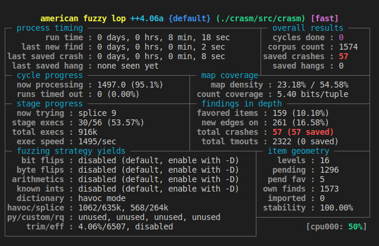

# Exercise Three

## tl;dr

Fuzz `crasm` to find a bug. Make a dictionary and find a good seed.

## Learning Objectives

- Fuzz a real-world C program.
- Create a dictionary to assist the fuzzer find interesting input.
- Find a good seed for the program.

## About

Exercise three is a real-world C executable available on the Debian package manager called `crasm`. The source is hosted on [GitHub][crasm]. We've cloned the project and checked out a vulnerable state (i.e. `git checkout 932f329`). `crasm` is an assembler for some 16-bit architectures like the Z80 and 6800. This introduces us to the second law of fuzzing: where there are parsers, there are bugs. An assembler is a perfect example of a parser.

There are two goals of this exercise.

- Create a dictionary to assist the fuzzer find interesting input.
  - Do you observe a meaningful difference having used the dictionary?
- Find a good seed for the program.
  - Are these example assembly files?
  - Does having a good seed influence the speed at which the fuzzer finds
    meaningful input?

## Compilation

You can compile the program with the included [Makefile](./Makefile) in this
directory. If you're using Docker, skip to the [Docker](#docker) section.

```shell
$ make

# Should yield something similar to following output (Linux on amd64).
cd ./crasm && \
CC=afl-clang-fast CFLAGS="-Og -ggdb -fno-omit-frame-pointer -fno-inline-functions -fno-stack-protector -z execstack" make && \
echo "[+] Done compiling crasm." && \
file ./src/crasm
<Lots of out here we will ignore.>
SanitizerCoveragePCGUARD++4.05a
[+] Instrumented 218 locations with no collisions (non-hardened mode) of which are 13 handled and 0 unhandled selects.
afl-clang-fast -O -Wall  -o crasm crasm.o stdvocabulary.o pseudos.o macro.o label.o parse.o filter.o operator.o output.o xref.o scode.o cpulist.o cpu6800.o cpu6502.o cpuz80.o -lm
afl-cc++4.05a by Michal Zalewski, Laszlo Szekeres, Marc Heuse - mode: LLVM-PCGUARD
done
make[2]: Leaving directory '/home/siuser/Developer/bsides-charm-training/exercises/exercise-three/crasm/src'
make[1]: Leaving directory '/home/siuser/Developer/bsides-charm-training/exercises/exercise-three/crasm'
[+] Done compiling crasm.
./src/crasm: ELF 64-bit LSB pie executable, x86-64, version 1 (SYSV), dynamically linked, interpreter /lib64/ld-linux-x86-64.so.2, BuildID[sha1]=aa345efeb5f049efc309adf0732ee373bf57231e, for GNU/Linux 3.2.0, with debug_info, not stripped
```

## Docker

Alternatively to compiling it on your host, you can build the referenced
container with the following commands. This container uses the [aflplusplus][docker-aflplusplus] container as a base.

```shell
# Ensure that your current working directory is /exercises/exercise-three/
$ docker build --tag exercise-three .
... <lots of output here>
Successfully built eacb16515dd6
Successfully tagged exercise-three:latest

# Run the container. This time we are mounting a volume to persist the output.
$ docker run --volume $(pwd)/output:/output --interactive --tty exercise-three:latest
```

## Usage

The compiled `crasm` executable will be placed in [crasm/src](./crasm/src/). It requires at least one input file passed in as an argument (again, don't print the `$`).

```shell
# Without a file, it prints its usage.
$ crasm
No input!
Syntax:  crasm [-slx] [-o SCODEFILE] INPUTFILE
Crasm 1.10 known CPUs:
         6800 6801 6803
         6500 6502 65C02
         Z80

# With a file, it attempts to assemble the code.
$ crasm ./<an example file>
Pass #1
Pass #2
Crasm 1.10:                                                   page  1
<lots of output here>
ERRORS:      24
WARNINGS:     0

No code generated...
```

## Fuzzing

The goal of this exercise is to experiment with a dictionary and a good starting seed. Do both experiments separately. For the dictionary, you will need to add the `-x` flag followed by the path to a file containing your values. I've created one for you in [dictionary/dictionary.txt](./dictionary/dictionary.txt). Remember from [exercise two](../exercise-two/README.md) that we also need the `-i` flag for the input directory and the `-o` flag for the output. For this class, we'll also use the `-s` flag with the value 1337 just so we all get similar results. :smile:

### Example Commands

```shell
# Without a dictionary. Remember, your directory structure is probably different.
afl-fuzz -s 1337 -i /exercise-three/testsuite/ -o /output/ /exercise-three/crasm/src/crasm @@

# With a dictionary
afl-fuzz -s 1337 -i /exercise-three/testsuite/ -o /output/ -x /exercise-three/dictionary/dictionary.txt /exercise-three/crasm/src/crasm @@
```

### Output

You should observe, within ~ten minutes, that the fuzzer has found at least one crash.



Run the program with the crashing input to see what happens. Note the following output is an example. The name of your crashing input might be different.

```shell
./crasm/src/crasm ./output/default/crashes/id\:000000\,sig\:11\,src\:001151+001324\,time\:380418\,execs\:782843\,op\:splice\,rep\:16 
Pass #1
Segmentation fault
```

Try running the same thing under GDB (or LLDB for Mac users) to get a stack trace.

For GDB, you'll need to preface the previous command with `--args` to pass in the filename.

```shell
gdb --args ./crasm/src/crasm ./output/default/crashes/id\:000000\,sig\:11\,src\:001151+001324\,time\:380418\,execs\:782843\,op\:splice\,rep\:16
```

For LLDB users, you'll need to pass in `--`.

```shell
lldb -- ./crasm/src/crasm ./output/default/crashes/id\:000000\,sig\:11\,src\:001151+001324\,time\:380418\,execs\:782843\,op\:splice\,rep\:16
```

Your output may look something like...

```shell
ERRORS:      13
WARNINGS:     0

No code generated...
[Inferior 1 (process 3363296) exited normally]
```

Exited normally? But we got a segmentation fault without the debugger! What's going on? The tidbit of information you need is that debuggers disable ASLR (address space layout randomization). This type of bug class will be a lot easier to debug if we re-enable ASLR with the `gdb` command `set disable-randomization off`. Try it out and see what happens.

```shell
(gdb) set disable-randomization off
(gdb) run
...
Program received signal SIGSEGV, Segmentation fault.
0x00005558d970f540 in Xasc ()
```

Bingo!

[docker-aflplusplus]:https://hub.docker.com/r/aflplusplus/aflplusplus
[crasm]:https://github.com/colinbourassa/crasm
