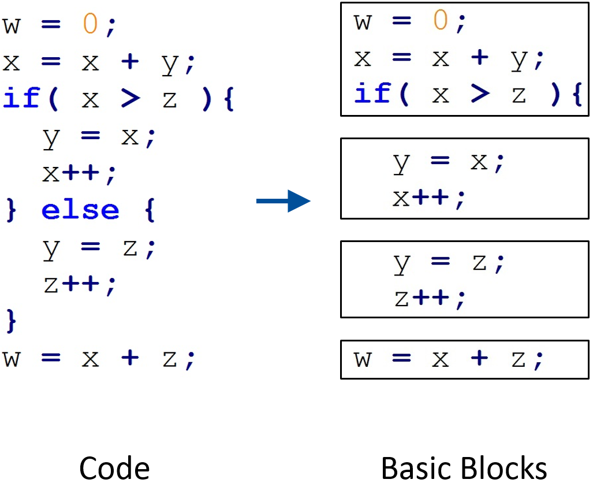
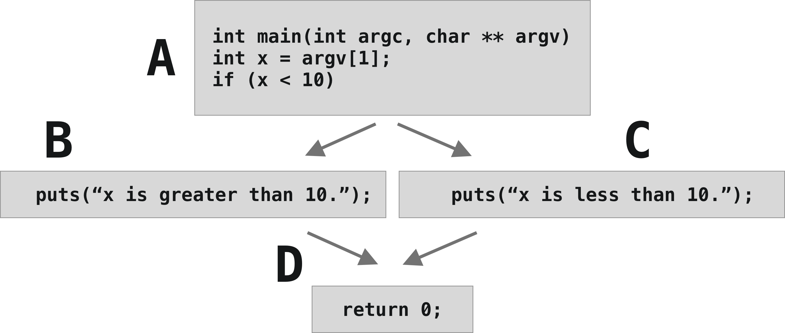
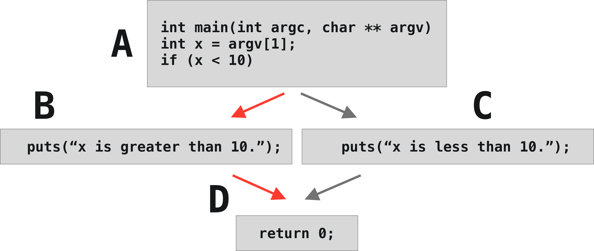
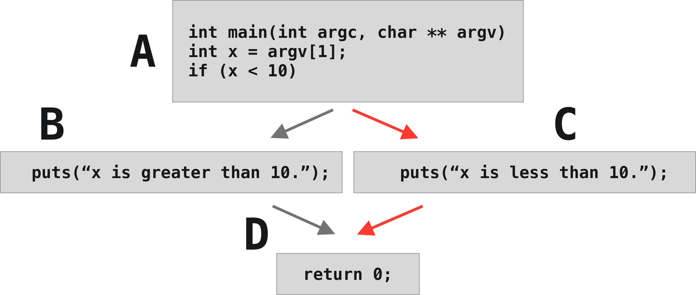
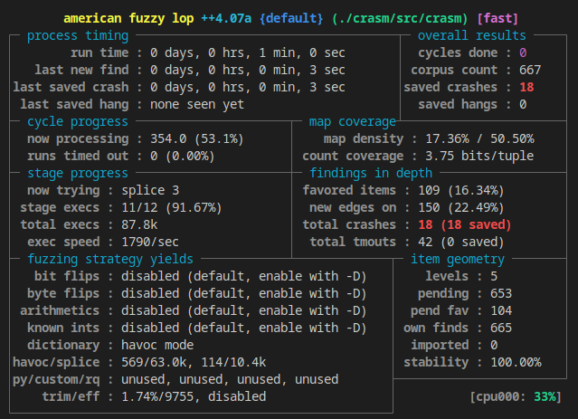
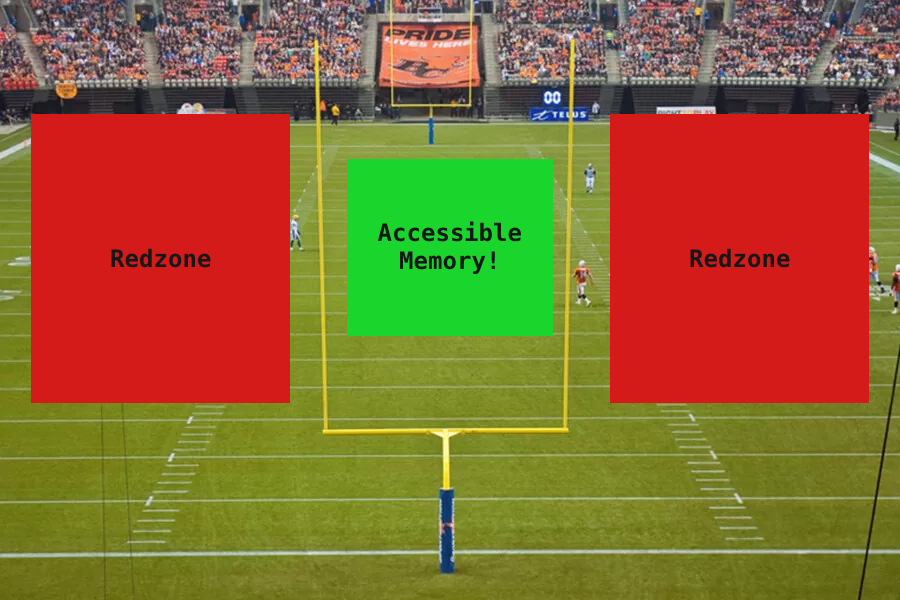
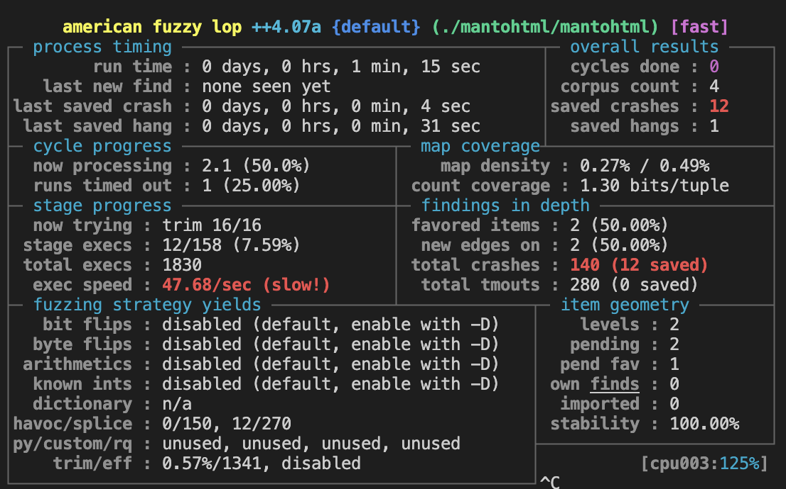
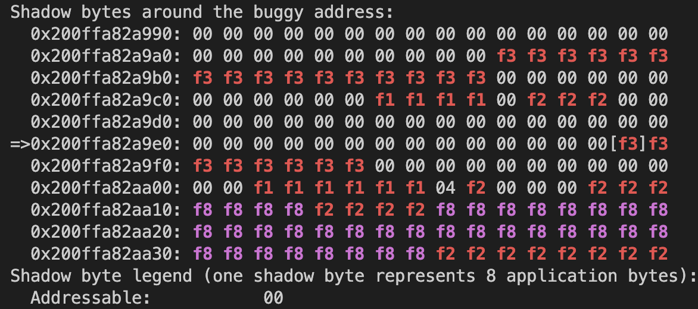
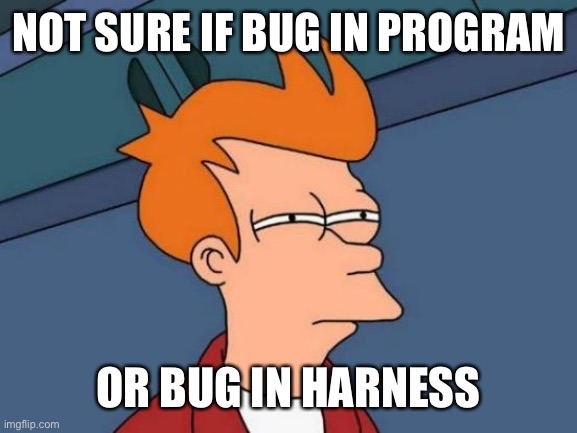
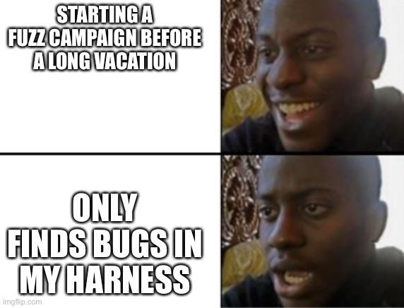

# Fuzzing
#### Sean Deaton & Ryan O'Neal

---
The Materials

If you didn't already, go ahead and clone the repository. Make sure to recurse on the submodules. If you already cloned without them, you can run `git submodule init && git submodule update` to get them. If you didn't install AFL on your host machine, you can pull the base Docker image. I'll be using Docker for the exercises, but you can always install AFL on your host machine and run it natively.

These things will save you time when it comes to the exercises.

```sh
# Clone the repository (also on USB).
$ git clone --shallow --recurse-submodules --shallow-submodules https://github.com/WhatTheFuzz/bsides-charm-fuzz-training.git

# Pull the base Docker image.
$ docker pull aflplusplus/aflplusplus
```

---

About Us


Hello, I'm Sean Deaton. I learned to love computing in college where I initially studied chemistry and then hopped over to the computer science realm. After college I joined the Army where I got to lead a bunch of reverse engineers doing cool things. I left the Army last year and now work as a senior vulnerability researcher for the government. It was while I was in the Army that I got to meet my good buddy Ryan.


---

## Agenda & Rules

First, we're going to talk about what fuzzing is and have a bit of a refresher on software bugs in C. Then we'll talk about how fuzzers work before we fuzz some real-world examples, including an assembler, a format converter, and `openssl`. Sound good?

---
### Like Monkey on a Typewriter
## What is Fuzzing?

Fuzzing, sometimes called fuzz testing, can be thought of as providing an infinite amount of inputs to a program to cover edge cases developers didn't think about.

---

## Actually Though


The analogy that I like to use involves a bunch of monkeys in the Library of Congress. If you put five monkeys at a table, each with their own little typewriters, and just have them plug away forever...Eventually, they will write all of the books in the Library in the order in which they appear on the shelves.

How does that relate to fuzzing?

Similarly, fuzzing is the act of generating inputs (ie. monkeys at the keyboard) and passing that input to a program. You then observe the program and see what happens. Did the input that you created have some effect on the program? Maybe it did something different than before? 


---
### Why Fuzzing?

---

Typically, people are fuzzing to find crashing input. Crashing programs are bad. Crashing programs mean that developers did something wrong. Those are the interesting cases.

Let's look at an example.


---
## Exercise One
	What is a bug?

---

Before we talk about how AFL works, let's talk about basic blocks. Basic blocks are contiguous segments of instructions that don't branch or return. Here's a great example.

We have the assignment of two variables, `w` and `x` followed by the start of a conditional. That's one basic block.

Then we have the two blocks guarded by the conditional, the true and false cases.

Finally, we have the assignment of `w`. That in itself is a basic block.





Now that we've covered what basic blocks are, let's talk about fuzzing and how the two concepts relate.

---

## Enter AFL
	- Coverage-guided fuzzer


There are lots of fuzzers out there. AFL happens to work with a wide range of use cases and so anyone who has fuzzed anything has worked with AFL. AFL is considered a coverage-guided fuzzer. This means that each time a new input is generated from the program, AFL checks to see if the program did anything new with the input (ie., is it interesting?). If something interesting happens, it'll continue to mutate that input to discover other new and interesting behaviors.

---
## How does AFL work?
	- 64kB shared memory.
	- Tracks source and destination blocks as tuples.
	- Maintains hit count of these blocks as tuples.

How do we define interesting behaviors? There are two methods that AFL uses:

AFL creates a shared memory map (64kB) that effectively tracks source and destination blocks in the program as tuples. It maintains a global list of these tuples. Each time an input is processed, if new tuples are produced, these test cases are interesting.

AFL maintains the number of times each tuple was encountered in a path (called a hit count). Although a simplification, the greater the hitcount of specific tuples results in interesting test cases. This catches when the input causes a state transition to and from blocks multiple times when previous iterations may have only seen that transition once.

---
 
If none of that made sense, don't worry. Here's an example. We have a block of code that's similar to what we saw before.

```c
int main(int argc, char ** argv)
	int x = argv[1];
	if (x < 10) {
		puts(“x is less than 10.”);
	}
	else {
		puts(“x is or exceeds 10.”);
	}
	return 0;
} 
```
 
---
It has four total basic blocks. That looks something like this. At the top, we have our initialization and assignment of `x` followed by the conditional check of `x`. In the middle, we have two blocks guarded by the conditional and the final return block. I've labeled them A, B, C, and D. Our goal with this program is to reach 100% block coverage. That is, we need to touch each block at least once.




---
The first input we could give to the program is something that satisfies the constraint `x` greater than 10. This will take us from block A to block B. Then from block B to block D.




---
The other input must satisfy the constraint `x` less than 10. This would bring us from block A to C to D.




---
With these two inputs, we can represent the coverage with these tuples and their respective hitcounts. This is precisely what AFL is doing under the hood. If AFL generated input and it had never saw those tuples before, or those tuples had a different hit count, then it knows that a new execution path was discovered.

## 💯 Coverage
	AC→CD: 1
	AB→BD: 1

---

How can it do this? Through instrumentation! Instrumentation takes care of tracking these tuples and hitcounts, then communicating those with the fuzzer. AFL provides the following:

## Instrumentation
#### Getting Coverage Information

---
This part is easy. We can just swap compilers. Has anyone here used `gcc` or `clang`? These are drop-in replacements for those compilers. We won't cover too many of the differences between each one. LTO stands for link time optimization and is usually the fastest, the `fast` compilers have implementations in the compiler themselves, and the regular `afl-clang` and `afl-gcc` 

## Easy - Swap Compilers
	- afl-clang-lto (best)
	- afl-clang-fast
	- afl-gcc-fast
	- afl-clang
	- afl-gcc (worst)

---

	> From even the smallest of seeds, grow the mightiest of trees.
	- sean deaton, maybe

Before we get to instrumenting the target, we need to talk about seeding the target. In exercise one, we identified that the target read from a file that was passed in to argv[1]. Additionally, we saw that the program read the input from the target and wrote it to stdout. Instinctively, we typed ascii characters on the keyboard (or maybe you were really cool and used Latin unicode characters or something) into the file. The fuzzer isn't always that smart. It really helps out the fuzzer when we give it an example of the input. This is called a seed. This can be something as simple as aaaa or Hello world!. Some simple, non-crashing that the fuzzer can pass to the program to get initial information. Seeds are also the basic building blocks for the fuzzer to mutate. It'll take that seed (or seeds, we can use multiple), and perform operations to increase the length, flip bits, change characters, add non-printable characters. For our next example, the exact seed that you give it is less important. However, for applications that rely on very strict formats, like XML, packet captures, HTTP, providing a seed significantly increases the coverage the fuzzer is able to obtain as it's starting out. Thinking of it another way, how long would it take you, randomly bashing on a keyboard, to generate a valid HTTP request? Probably a long time. A seed is a sort of template the fuzzer can use to understand the format of the input.

Let's instrument our first executable and provide a valid seed with exercise two.
---

	Hello world
	Hello borld
	Hello bolrdd
	Hello bolr🀞d
	hEllo b🀢🀫⚉⎔
	hEsdf sdfsdl
	Helloworld

---

## Exercise Two
	Fuzzing Our First Target

---

AFL's output can be confusing at first. So let's break it down.

## What Are We Looking At?

---

Process Timing

```text
+----------------------------------------------------+
|        run time : 0 days, 8 hrs, 32 min, 43 sec    |
|   last new path : 0 days, 0 hrs, 6 min, 40 sec     |
| last uniq crash : none seen yet                    |
|  last uniq hang : 0 days, 1 hrs, 24 min, 32 sec    |
+----------------------------------------------------+
```

- Run time: Total amount of time spent fuzzing.
- Last new path: The time since the last new test case was generated that caused a new execution pattern.
- Unique crash: The time since the last new test case was generated that caused a crash. Probably the most important field!
- Unique hang: The time since the last new test case was generated that caused the problem to be unresponsive for longer than a specified duration. By default, this is one second (`AFL_HANG_TMOUT`).

---

Results

```text
+-----------------------+
|  cycles done : 0      |
|  total paths : 2095   |
| uniq crashes : 0      |
|   uniq hangs : 19     |
+-----------------------+
```

The last three fields are just the total counts for what we saw in process timing. The first field is new. Cycles refer to the number of times the fuzzer looked at all of the unique test cases and mutated them. Say you have five test cases. If the program took all of those test cases, mutated them in various ways and failed to generate any new test cases, that would be one cycle. The next
cycle might mutate them in different ways that do generate new test cases. This field can give you an idea for how many new paths your fuzzer is finding. AFL
colors codes this for you. Purple means it's the first cycle. Yellow means new paths are being generated during cycles. Blue means no new paths are being
generated in the cycle. This might tell you to either end the fuzzing campaign or reexamine how you're providing input.

---
#### Cycle Progress
```
+-------------------------------------+
|  now processing : 1296 (61.86%)     |
| paths timed out : 0 (0.00%)         |
+-------------------------------------+
```

- Now processing: Informs you of the current test case being examined this cycle, as well as a percentage of how far along it is in the cycle.
- Paths timed out: New inputs that were discarded for timing out.

---

Stage Progression

```text
+-------------------------------------+
|  now trying : havoc                 |
| stage execs : 237/256 (92.58%)      |
| total execs : 121k                  |
|  exec speed : 3985/sec              |
+-------------------------------------+
```

- Now trying: The mutation algorithm. Havoc does fixed-width operations like bit flips, dictionary additions overwrites with integers, and others.
- Stage exes: Number of executions during this stage (ie how many executions with this specific mutation strategy, like havoc).
- Total exes: The total number of times your program has been called.
- Exec speed: The number of times your program is called per second. This should be as high as possible. Like greater than one thousand. Definitely greater than 100. Somewhere in between is OK.

---
Once AFL says that we have a crash, we need to do a couple of things.

First, confirm the crash with the target you instrumnted with `afl-clang` or whichever `afl` compiler. Get a backtrace and understand the crash.

Then, minimize the crashing input.

Finally, confirm the crash works on a non-instrumented target. As in, recompile your target with regular `gcc` or `clang`.

### AFL says we have a crash. Now what?
	1. Confirm the crash.
	2. Minimize the crashing input.
	3. Confirm it works on the non-instrumented target.

---

## Confirm the Crash
```shell
$ ./exercise-two ./output/default/crashes/crash.txt

The contents of the file are: bug�
Hmm, how did you get here?
Something isn't right.
Found a bug.
[1]    302466 IOT instruction (core dumped)  ./exercise-two
```

---
We can run the program under `gdb` (Linux) or `lldb` (macOS) and get information
on where exactly the bug is in the source code.
## Run under a Debugger
```shell
$ gdb --args ./exercise-two ./output/default/crashes/crash.txt

$ lldb -- ./exercise-two ./output/default/crashes/crash.txt
```
---
For example, using `backtrace` in `gdb` shows us the fault is on line 64 in
`main.c`

## Figure out the Bug
```c
$ (gdb) backtrace
...
main (argc=argc@entry=2, argv=argv@entry=0x7fffffffdc68) at exercise-two.c:64
...
```

---
AFL provides a test case minimization tool called `afl-tmin`. The application
needs two parameters, the input file (`-i`) we want to minimize and the name of the
output file where the minimized result is written. For example, two, consider the test cast `bugggggggg`. This will cause the program to crash because the first three characters are `b`, `u`, and `g`. But it could be shorter. Let's minimize it.

#### Minimizing the Test Case
```shell
# Write the non-minimized test case to a file.
$ echo "buggggggggggg" > max.txt

# Use afl-tmin to minimize it.
$ afl-tmin -i max.txt -o min.txt ./exercise-two @@

# Examine the minimized output.
$ cat min.txt
bug # Without a newline.
```

---
You're in good shape if you've made it this far and understood at least half of what I've blurted out. Pat yourself on the bat. We will move on to exercise three after the break, which will be our first real-world program.

If we haven't already, let's take a break.

## Break Time

---
How do you fuzz things like JSON, XML, HTML, or other structured data? You could let the fuzzer just keep mutating inputs until it finds something interesting. But that could take a long time. It would be great if we could tell the fuzzer to mutate the input in a way that makes sense for the data format.

## Grammar is Hard
### Dictionaries make it easier.

---

What structured elements do you see? `html`, `body`, `h1`, `p`. These are all keywords that we can inform the fuzzer about beforehand. This is what's called a dictionary.
#### My Awesome Webpage
```html
<!DOCTYPE html>
<html>
   <body>
      <h1>My First Heading</h1>
      <p>My first paragraph.</p>
   </body>
</html>
```

---

We can structure the dictionary in a couple of ways (each fuzzer may be different). AFL lets you write them each as separate files, or you can write them as key-value pairs in a single file separated by a newline.
#### An Example Dictionary
```text
tag_html="<html>"
tag_body="<body>"
tag_p="<p>"
tag_h1="<h1>"
```

With these values, the fuzzer might concatenate multiple values or insert values in addition to mutational generation.

---

We talked about seeds earlier, but now that we've covered dictionaries, I want to relay just how important it can be to provide a good seed or good starting dictionary. It makes the fuzzers jobs so much easier. A great blog post titled "Pulling JPEGs out of thin air" from the creator of AFL, Michal Zalewski, talks about this in more detail.

The following are JPEGs that a fuzzer generated when fuzzing a JPEG metadata tool. It took six hours on an 8-core system to generate the first image when given a starting seed of "hello" as text. As the title of blog post implies, the fuzzer seemingly pulled these images out of thin air. But really, by determining what inputs caused interesting and new behaviors.

#### Pulling JPEGs Out of Thin Air


---
Sweet, who is ready to move on to exercise three?

## Exercise Three

---

Now we're moving on to the first real-world target we will fuzz. It's an open-source project called [crasm](https://github.com/colinbourassa/crasm). It's available on GitHub and the Debian package manager, which is how I originally found it. It's an assembler for some 8-bit architectures like the 6502 and Z80.

## crasm

---

An assembler is a great example of a parser.

### Laws of fuzzing
	1. If you fuzz something no one else has, you will find bugs.
	1. Where there are parsers, there are bugs. ⬅️

---

Let's look at `crasm`'s input. Here's some example input for the program. Notice anything *structured* about it? Maybe a dictionary would help?

#### Input
```asm
cpu 6800
	
* = $8000

begin  = $40
dest   = $42
len    = $44


ldx  #$4000
stx  begin
ldx  #$1430
code
```

---

There is a README in the exercise three folder that's pretty verbose about how to build and run the target, but since this is our first real program, let's all make sure we can get there and actually run `crasm`. 
### Building Exercise Three
```shell
$ cd exercise-three

# If using Docker.
$ docker build --tag exercise-three .
$ docker run --tty --interactive exercise-three

# If using local install of AFL and not Docker.
$ make
```

---

The executable itself is called `crasm` and located under `exercise-three/crasm/src/`. It takes a single argument as input with some optional flags. If you run it without any parameters, it'll print information on how to use it. Run it with an input file and no flags for this exercise.

### Running Exercise Three
```shell
$ ./crasm/src/crasm 
No input!
Syntax:  crasm [-slx] [-o SCODEFILE] INPUTFILE
Crasm 1.11 known CPUs:
         6800 6801 6803
         6500 6502 65C02
         Z80
```

---

If you look in `/exercise-three/crasm/test`, you'll see a bunch of test cases. Let's run one of them. I'm choosing the `memcpy.6800.asm` file, but you could choose any of them. I've even included a plain "Hello world" text file in `testsuite/`.

### Running Exercise Three
```shell
$ ./crasm/src/crasm ./crasm/test/memcpy.6800.asm
ERRORS:       0
WARNINGS:     0

Successful assembly...
 Last address     102d (4141)
 Code length        5c (92)
```

---

We can fuzz the program pretty easily since it reads from a file passed in as the first argument. We can use the same command we used earlier to fuzz the `exercise-two` program.

#### Fuzzing Exercise Three
```shell
# Make sure you're in exercise-three.
$ cd exercise-three
$ afl-fuzz -s 1337
           -i testsuite/
           -o output/
           ./crasm/src/crasm @@
```

---

We talked about dictionaries earlier. Now we're actually going to pass one in. We can do this with the `-x` flag (in addition to the other ones we used earlier). That current dictionary is empty. It'll be your goal to fill in some values.

### One more flag
```shell
afl-fuzz -x ./dictionary/dictionary.txt
```

---
We're going to do some science here. We're going to have four fuzzing runs. Fuzz each one for one minute, take a screenshot or record the results, then terminate the job. Remove everything from the `output` directory and start the next one. We'll talk about the results after.

## Exercise Three Challenge
	- Hello world seed, no dictionary.
	- One good seed, no dictionary.
	- Hello world seed, dictionary.
	- One good seed, dictionary (then keep this one going).

You have fifteen minutes. Go go go! Ryan and I will be walking around to help.

---

Big caveat coming up.


---

Here are my results. Yours will be different. I'm running on a 20 core Xeon.

These might not extrapolate. One minute is a really short amount of time. Additionally, the corpus count doesn't give us insight into where the fuzzer gained coverage. They might have been in completely separate areas of the program. What I want you to take away from this is that seeds and dictionaries are important. Really important. They guide the mutator in a specific direction and cut down on the amount of time it takes to generate complex inputs.

```text
- No seed, no dictionary: 10 crashes, 604 corpus count
- One seed, no dictionary: 22 crashes, 642 corpus count
- No seed, dictionary: 35 crashes, 669 corpus count
- One seed, dictionary: 18 crashes, 667 corpus count
```

---

So we got some crashes. How do we go about testing them? Well, we can run the program.




---

We looked at the `output` directory before, and that's where we'll find our crashing inputs again. If we just run the program with the crashing input, we'll get a segmentation fault. This is because the program is trying to access memory it shouldn't. This is a good sign (for us).

#### Crashing the Program
```shell
$ ./crasm/src/crasm output/default/crashes/id\:000000...
Pass #1
Segmentation fault (core dumped)
```
---

We can triage the bug with GDB (if you're running Linux) or with lldb (if you're using a Mac). Make sure to add in the `--args` or just `--` respectively. That lets the debugger know to expect an argument, in this case the file we want to debug. `lldb` copied `gdb`'s syntax, so you can use the same commands in both.

#### Triaging the Bug
```shell
# For Linux users.
$ gdb --args ./crasm/src/crasm output/default/crashes/id\:000000...

# For Mac users.
$ lldb -- ./crasm/src/crasm output/default/crashes/id\:000000...
```

---
Here's the GDB output. In the Makefile used to compile this (and the rest of the exercises, actually), I included debug symbols to make triaging easier. Usually, you'd want to omit these while you're fuzzing to increase performance, but I didn't want to recompile or ship the binaries. Just note that for when you're doing your own fuzz testing.

What do we see? We see the program received a signal called `SIGSEGV`. This means the program tried to access some part of memory it shouldn't have. We also see the line number where the program crashed, which is really useful.

#### Triaging the Bug
```c
(gdb) run
...
warning: Error disabling address space randomization: Operation not permitted
...
Pass #1
1    
Program received signal SIGSEGV, Segmentation fault.
Xasc (modifier=0, label=<optimized out>, mnemo=<optimized out>, oper=0x0) at pseudos.c:221
221       delimiter = *s;
```

---

We even have the instruction which caused the fault. And with the power of debugging symbols, we can inspect the values of each variable at that point in time. If we print `s`, which is a pointer, we see its value is `0x0`. This is a null pointer. We're trying to access memory at address `0x0`, which is not allowed. We see this if we examine (`x`) memory and treat the result as a pointer (`/p`). We can't access memory at address 0x0.

```c
...
221       delimiter = *s;

(gdb) print s
print s
$5 = 0x0

(gdb) x/x s
0x0:    Cannot access memory at address 0x0
```

Before we go look at the source code, let's run a backtrace.

---
This is a little more helpful in understanding how we got to the line number. If you're not familiar with backtraces, what we're observing is the call stack. We can see that `Xasc` was called from `asmline`, which was called from `pass`, which was called from `crasm`, which was called from `main`. This is the order in which the functions were called. We can also see the arguments that were passed to `Xasc`. This is another benefit of debug symbols.

```c
(gdb) backtrace
#0  Xasc (modifier=0, label=<optimized out>, mnemo=<optimized out>, oper=0x0) at pseudos.c:221
#1  0x000055684cb9d81b in asmline (s=<optimized out>, s@entry=0x55684cbbd760 <curline> "asc", status=status@entry=3) at crasm.c:562
#2  0x000055684cb9ce4e in pass (n=n@entry=1) at crasm.c:274
#3  0x000055684cb9caae in crasm (flag=138) at crasm.c:180
#4  0x000055684cb9c812 in main (argc=<optimized out>, argv=<optimized out>) at crasm.c:147
```

---

Okay so let's look at the source code. Line 221 is the line where the program crashed (noted by the arrow). We know that `s` is zero when the program crashes. We see that `s` gets assigned to `oper` which is a character pointer passed in as an argument. So that must mean that `Xasc` was called with a null pointer as the fourth argument. Let's look at the call stack again.

#### Site of the Crash
```c
int Xasc(int modifier, char* label, char* mnemo, char* oper)
{
  register char* s;
  register char r;
  register char delimiter;

  s = oper;
  delimiter = *s; ⬅️

  if (delimiter != '\'' && delimiter != '\"')
  ...
```

---

Sure enough, GDB reports that `oper` was indeed NULL when `Xasc` was called. So let's look at `Xasc`'s caller, `asmline`.

#### The Backtrace Again
##### Note `oper=0x0`
```c
#0  Xasc (modifier=0, label=<optimized out>, mnemo=<optimized out>, oper=0x0) at pseudos.c:221
#1  0x000055684cb9d81b in asmline (s=<optimized out>, s@entry=0x55684cbbd760 <curline> "asc", status=status@entry=3) at crasm.c:562
```

---

Ooo, the caller is dereferencing a function pointer. I've seen a lot of bugs come up this way. There's an edge case that the developers didn't catch where `oper` remains NULL, but should have been assigned. This is variation of [CWE-457](https://cwe.mitre.org/data/definitions/457.html) leading to [CWE-476](https://cwe.mitre.org/data/definitions/476.html), a NULL pointer dereference. We could go through and track down the exact conditions, but that's outside the scope of our exercise. We can just look at the patch that fixed this bug.

#### crasm.c:562
```c
oper = NULL;
...
if (status & 2)
  {
    (*labmnemo->ptr)(labmnemo->modifier, label, mnemo, oper); ⬅️
  }
```

---


---

It's always important to fix any issues you see in open-source software. This is the patch that fixes the NULL pointer dereference but doesn't fix the logic error that caused it. Maybe that'll be something you can contribute back to the project.

```c
 /*  ASC string  */
 int Xasc(int modifier, char* label, char* mnemo, char* oper)
 {
+
+  if (oper == NULL) {
+    error("Need an operand");
+  }
+
   register char* s;
   register char r;
   register char delimiter;
```

---

What did you guys think? Let's take another break before looking at exercise four, which will cover detecting bugs that don't crash the program, like what we saw in exercise three.

## Break Time

---

## Sanitizers
	- Address Sanitizer (ASAN)
	- Memory Sanitizer (MSAN)
	- Thread Sanitizer (TSAN)
	- Undefined Behavior Sanitizer (UBSAN)

In exercise three, we found a crash that caused the program to crash. It read from memory it wasn't allowed to, and died. But what about bugs that don't cause the program to crash? What if that dereference we observed actually dereference memory that the program could access, but wasn't appropriate? What if it dereferenced a pointer after that memory was `free`'d? This might nto cause a crash, but is still incorrect and could be exploited. This is where sanitizers come in.

There are a number of algorithmic error detectors that you can compile into your code. For free on your part (well, there is a performance hit, but you can just add a flag when you compile!). These are called sanitizers. We're going to look at AddressSanitizer (ASAN) today, which can find a number of different memory errors, including use after free, buffer overflows, memory leaks, and initialization order bugs.

Additionally, there's also Memory Sanitizer that can detect uninitialized memory accessed. ThreadSanitizer detects deadlocks and race conditions. And Undefined Behavior Sanitizer detects undefined behavior in your code.

---

### What is AddressSanitizer?
	- Redzones and Shadow Memory (compile time)
	- Poisoned heap allocations (run time)


---


---



---

#### Dead Simple C Program
```c
_Noreturn func(void) {
    char buf[8];
    exit(0);
}
```

---
Here's what the compiler will actually do now.

#### A Little More Complicated
```c
_Noreturn func(void) {
    char redzone1[32];
    char buf[8];
    char redzone2[24];
    char redzone3[32];
    int * shadow_base_address = /* Mapping to real memory done here. */
    /* Poison the first redzone. */
    shadow_base_address[0] = 0xffffffff;
    /* Posion most of redzone2. Allow 8-byte access for buf. */
    shadow_base_address[1] = 0xffffff00;
    /* Posion the last redzone. */
    shadow_base_address[2] = 0xffffffff;

    /* Unpoison the stack before function ends. */
    shadow_base_address[0] = 0x00000000;
    shadow_base_address[1] = 0x00000000;
    shadow_base_address[2] = 0x00000000;
    exit(0);
```

---

This concept is also pretty simple. Each time we `free` memory, `free` will poison that memory address. If anything tries to access it, ASAN will pick that up and complain.


---

With ASAN, there's a few non-obvious things happening here. `malloc` will return a pointer to a chunk of memory. ASAN will transparently add redzones around that chunk of memory to look exactly how the stack layout looked before.

We then `free` that memory. ASAN will poison those chunks. So if we try and access them later, as in our dereference below, ASAN will throw an error.

#### Heap Implementation
```
_Noreturn func(void) {
    char * buf = malloc(16); /* Adds redzones. */
    free(buf); /* Posion the allocation. */
    buf[5] = 't'; /* Attempt a dereference. */
}
```

---

Okay, okay, we talked a lot about the nitty-gritty of ASAN. What's the point? The point is to detect vulnerabilities in code that might not crash immediately. Maybe it's an out-bounds-read or a small buffer overflow. It won't crash the program, but it could be exploitable.

### Where is this going?

---

## Exercise Four

---

## mantohtml

---

If you're using Docker, which I again recommend, it'll compile and run everything for you. If not, you can just run `make` so long as you have GNU-sed. I changed things last minute and noticed that Mac uses BSD's `sed`, which is incompatible. If you're running this on a Mac, raise your hand when we start, and I'll come over.

#### Building Exercise Four
```shell
# Docker
$ docker build --tag exercise-four .
$ docker run --interactive --tty exercise-four [/bin/bash]

# Without Docker (if you have GNU sed).
$ make
```

---

#### Running Exercise Four
```sh
$ ./mantohtml/mantohtml 
Usage: mantohtml [OPTIONS] MAN-FILE [... MAN-FILE] >HTML-FILE
Options:
   --author 'AUTHOR'        Set author metadata
   --chapter 'CHAPTER'      Set chapter (H1 heading)
   --copyright 'COPYRIGHT'  Set copyright metadata
   --css CSS-FILE-OR-URL    Use named stylesheet
   --help                   Show help
   --subject 'SUBJECT'      Set subject metadata
   --title 'TITLE'          Set output title
   --version                Show version
```

---

#### Running Exercise Four
```sh
$ ./mantohtml/mantohtml ./mantohtml/mantohtml.1 
<!DOCTYPE html>
<html>
  <head>
    <meta name="creator" content="mantohtml v2.0">
    <title>Documentation</title>
  </head>
  <body>
...
```

---

Because the program takes input from a file passed in via the command line, it's pretty simple to fuzz. We could create a dictionary since `man` pages are pretty structured, but we won't for now. Even with a dictionary, it might take your machine awhile to find the bug, so I've gone ahead and added them to your `testsuite` folder. You won't find them until you've completed the challenge, which is...

#### Fuzzing Exercise Four
```sh
afl-fuzz -s 1337
         -i ./testsuite/
         -o ./output/
         ./mantohtml/mantohtml @@
```

---

There are two goals of this challenge. Recompile the executable with support for AddressSanitizer and 32-bit support. The latter might be a nightmare without Docker depending on your host, so just give it a reasonable try. If you can't get it working, you should still get a crash.

### Exercise Four Challenge
	Recompile with:
		- AddressSanitization
		- 32-bit support*

---
I've already gone ahead and helped you out with these challenges. If you're on an Apple Silicon Mac, just leave the 32_BIT flag empty. If you get any compiler errors that seem wonky, don't worry about it. Just note it for future fuzz tests. :)

I'm not going to supply any resources for these ones. Maybe Google AFL ASAN? Linux compile 32 bit x86?

Either run the `docker build` stage again or `make` after you figure out the flags. Then start fuzzing.

#### Modify the Makefile
```sh
$ vim Makefile

# TODO, add the environment variable that will compile the program with ASAN.
ENABLE_ASAN = # TODO (might look like X=Y)
# TODO, compile as a 32-bit binary.
32_BIT = # TODO (might look like -X)

```

---

You should stumble upon the crash pretty quickly. You'll probably start off with reallllllly slow executions per second (2 or 3) as the fuzzer trudges through long test cases.




---

#### Pass the Input to the Program
```sh
$ ./mantohtml/mantohtml ./output/default/crashes/crash.txt

ERROR: AddressSanitizer: stack-buffer-overflow on address 0xffffd4154f70 at pc 0xaaaab4fee04c bp 0xffffd41548b0 sp 0xffffd41548c0
READ of size 1 at 0xffffd4154f70 thread T0
    #0 0xaaaab4fee048 in man_puts /exercise-four/mantohtml/mantohtml.c:1207
...
```

---

If we run `mantohtml` with the crashing input, we'll get a different type of output then we're used to. It's a lot of colors and pretty intimidating if I'm being honest. Let's break down what it means, though.

Above this output, it told us we had a stack-based buffer overflow. That's helpful. We compiled with the debugging symbols, so it even gave us the line number and variable names that were overflowed.

Towards the end of the output is something that looks like this picture. Lots of colors. The `00` represent addressable memory. The `f3`s represent the *right* side of the redzone. The parenthesis represent the location where the faulting access occurred. So in this case, we can see that something from the stack overwrote something in one of the redzones. We have a buffer overflow!




---

We won't go into triaging this one, since I want to cover more fuzzing topics, but feel free to look later. Essentially, the fix was just to check if the contents of a buffer were NULL before incrementing to the next element. It was just an off-by-one error that your fuzzer wouldn't have caught without ASAN. Cool, right?
#### The patch
```c
-    s ++;
+    if (*s)
+        s ++;
     break;
```

---

## Break Time

---

Our earlier two real-world examples were pretty easy to fuzz. We fuzzed the entire program just by passing in an argument to the command line. But that's pretty limiting. What if we want to fuzz monolithic programs like Adobe Reader, parts of the kernel, Firefox, or openssl? To phrase it another way, how do we fuzz entire libraries?

Many of those programs take input from multiple places. In the case of libraries, there are no entry points at all. Think about Firefox. You can open webpages, import bookmarks from ye olde Internet Explorer, run Javascript, run extensions, and so on. None of those just read from a file. Well, maybe opening a webpage. But the others are harder. 

## What's Next?

---
This is where fuzzing harnesses come in. At their simplest, they are ways to read input into your target. At their most complicated, they can patch execution, hook functions, and modify things at runtime with dynamic linking. Let's look at a simple example.

## Fuzz Harness

---

Here's a function that takes a socket file descriptor as input. It creates a buffer on the heap and then reads from the socket into the buffer, up to 99 bytes. Say we want to fuzz this function in particular. How can we do that? It doesn't read from a file. It doesn't read from standard in. It reads from a socket.

#### Simple Example
```c
int read_network_input(int socket_fd) {
	char * buf;
	int i;
	buf = malloc(100);
	i = recv(socket_fd, buf, 99, 0);
	do_something(buf);
	return i;
}
```

---

What if we make own program?


---

So here, we're just making a simple `main` function that we will compile into our own program. It'll simply open the file that we pass into `argv[1]` and pass the file descriptor to the function we want to fuzz. Seems easy enough?

```c
int main(int argc, char ** argv) {
	char * filename;
	int fd;

	filename = argv[1];
	fd = open(filename, O_RDONLY);
	
	read_network_input(fd);
	exit(0);
}
```
---

Sometimes it's harder than it looks. A big part of fuzzing programs is iterating on and improving harnesses to target different parts of the code or make it more effective.


---
Sometimes harnesses get so complex you're unsure if you've introduced a bug!




---

Or the worst, you leave a fuzzing job running for awhile without checking on it, and you totally messed up your harness.




---

In openssl, there was a bug late last year in certificate validation. An attacker could craft a malicious e-mail address containing many `.` (decimal) characters to overflow bytes on the stack. It was a classic stack-based buffer overflow.

## CVE-2022-3786

---

Here's just part of the patch that fixed the bug. You can see they added a maximum size field and additional checks to the function. I'm hand waving a lot of the bug because I want you give you more time to fuzz it, but in essence, they weren't doing proper bounds checks and were relying on the presence of a decimal character to inform the function when to stop writing.

```
int ossl_a2ulabel(const char *in, char *out, size_t *outlen)
     char *outptr = out;
     const char *inptr = in;
-    size_t size = 0;
+    size_t size = 0, maxsize;
     int result = 1;
-
+    unsigned int i, j;
     unsigned int buf[LABEL_BUF_SIZE];      /* It's a hostname */
-    if (out == NULL)
+
+    if (out == NULL) {
         result = 0;
+        maxsize = 0;
+    } else {
+        maxsize = *outlen;
+    }
```

---

The problem is that openssl doesn't just let you pass input to the function `ossl_a2ulabel`. So that's where a harness comes in. We need to write a program that calls the function we want to test.

### The Problem

---

You might have noticed that the input to the function isn't a file descriptor. It's two character pointers and a `size_t` pointer. We need to figure out how this function is called in the program and recreate that.

### The Input
```c
int ossl_a2ulabel(const char *in, char *out, size_t *outlen)
```

---

### Switch to VS Code and show harness.

---

### The Challenge
	- Modify the call to `ossl_a2ulabel` in the harness.
	- Fuzz your harness.
	- Get the crash.

---
Remember to modify the harness. Docker and `make` will both fail if you don't. We'll take fifteen minutes. It's going to be quite slow in the beginning. That's okay. Take a break while it does its thing.

#### Docker Won't Build Until You Do!
```text
#12 0.195 harness.c: In function 'main':
#12 0.195 harness.c:75:28: error: 'TODO' undeclared (first use in this function)
#12 0.195    75 |     result = ossl_a2ulabel(TODO, TODO, TODO);
```

---

## Break

---

# Want to go fast?
	* shared memory fuzzing
	* persistent mode
	* deferred mode

Now we are going to talk about some items that you can use to speed up your fuzzing campaigns

---
# Shared Memory Fuzzing


---
# currently
	```
	int main(int argc, char ** argv) {
		int fd;
		char buf[BUFSIZE];
		if (argc != 2){
				fprintf(stderr, "Usage: exercise-one <filename>\n");
				return EXIT_FAILURE;
		}
		/* Open the file. */
		fd = open(argv[1], O_RDONLY);
		if (fd == -1){
				fprintf(stderr, "Could not open file %s.\n", argv[1]);
				return EXIT_FAILURE;
		}
		if (read(fd, buf, BUFSIZE-1) == -1) { /* Sus. */
				fprintf(stderr, "Could not read from file %s.\n", argv[1]);
				return EXIT_FAILURE;
		}
		if (close(fd) != 0) {
	      fprintf(stderr, "Could not close file %s.\n", argv[1]);
	      return EXIT_FAILURE;
	  }
	  ...
	}
	```
In exercise 2, we see an example of how the fuzzing buffer is brought into the program. It is read from `argv`, opened and then read into a local buffer. This all takes time, and AFL has the ability to directly write into the fuzzed process's memory to speed this process up

---
# Alternate implementation
	```
	__AFL_FUZZ_INIT();
	
	int main(int argc, char ** argv) {
		char *buf = __AFL_FUZZ_TESTCASE_BUF;
		if (argc != 2){
				fprintf(stderr, "Usage: exercise-one <filename>\n");
				return EXIT_FAILURE;
		}
		...
	}
	```

With shared memory fuzzing, we can replace all of the code needed for opening from the test file and reading from it, and can just reference it directly in the code

This also means that when you call the binary, the fuzz buffer was previously passed in as `@@`, but now AFL will directly mutate the input in `__AFL_FUZZ_TESTCASE_BUF` 

--- 
# Persistent Mode and Deferred Mode

Before we talk about persistent mode and deferred mode, we need to quickly talk about the AFL fork server
---
# Forkserver
	- By default, calls `fork` just prior to hitting `main` 
	- Child processes are spawned, and mutated input is passed to the `fork`ed process

The fork server is what allows AFL to spawn off all of the instances of your binary, and helps to improve the speed of instantiating the process. AFLplusplus says that this implementation	leads to a speedup of 1.5-2x over the usual method of doing `execve`, running the loader, etc etc.

---
# Deferred Mode
	In deferred mode, we can delay the location of the forkserver

---

	```
	void abc(){
		...
		__AFL_INIT();
		// code you care about
		...
	}
	
	int main(){
		...
		abc();
		...
	}
	```

In deferred mode, you get to delay the place where the fork server happens. This means that all subsequent instances will be started with all of the code that comes before the call to `__AFL_INIT` having already been executed.

QUESTION: can you force any issues that may occur with improper placement of the location of a call to `fork`?

---

# Make sure the `__AFL_INIT` is run before:
	- Files/sockets have been opened
	- Code that is dependent on the contents of your fuzzing input
	- Any timers
	- Creation of important threads/child processes

- If you fork after files/sockets have been opened, you are probably creating race conditions

---
# Persistent Mode
	In persistent mode, we are running a bit of code multiple times in a given fork
---
	```
	  while (__AFL_LOOP(1000)) {
	
	    /* Read input data. */
	    /* Call library code to be fuzzed. */
	    /* Reset state. */
	
	  }
	
	  /* Exit normally. */
	```

As you see here, the intent is that within the `__AFL_LOOP`, you call the piece of code that you are interested in 1000 times before exiting the program. 

QUESTION: What potential problems can you forsee with running a function multiple times when it was not intended to be used in that way?

--- 
# Persistent gotchas
	- Calling functions that alter globals is painful
	- Look for code to iterate over that retain the same behavior on each call
	- each iteration of `__AFL_LOOP` will mutate `__AFL_FUZZ_TESTCASE_BUF`, but the assignment the fuzz buffer pointer should be done prior to the `__AFL_LOOP` line

When you call functions whose behavior varies depending on the state of globals/modifies those globals, behavior between each loop iteration can vary and you can be left with loop iterations that are just useless

--- 
# Putting it all together
```
__AFL_FUZZ_INIT();
main() {
  // anything else here, e.g. command line arguments, initialization, etc.

#ifdef __AFL_HAVE_MANUAL_CONTROL
  __AFL_INIT();
#endif
  unsigned char *buf = __AFL_FUZZ_TESTCASE_BUF;  // must be after __AFL_INIT and before __AFL_LOOP!

  while (__AFL_LOOP(10000)) {

    int len = __AFL_FUZZ_TESTCASE_LEN;  // don't use the macro directly in a call
                                      
    if (len < 8) continue;  // check for a required/useful minimum input length

    /* Setup function call, e.g. struct target *tmp = libtarget_init() */
    /* Call function to be fuzzed, e.g.: */
    target_function(buf, len);
    /* Reset state. e.g. libtarget_free(tmp) */
  }
  return 0;
}
```

--- 
# Your turn: Exercise 6

---
	Get a better understanding for how all 3 features (shared memory fuzzing, persistent mode, and deferred mode) interact with each other

The objectives for exercise 5 is to get a better understanding for how all 3 features (shared memory fuzzing, persistent mode, and deferred mode) interact with each other

You can look at the example files provided in the exercise 6 to explore the interactions between the 3 features we talked about

---
# Exercise 7: Revisiting Exercise 5
	Try and apply the stuff we learned in the previous activity and try to speed up the harness we created

Seeing as we just learned some new stuff, let's see if we can improve on our harness for Exercise 5
